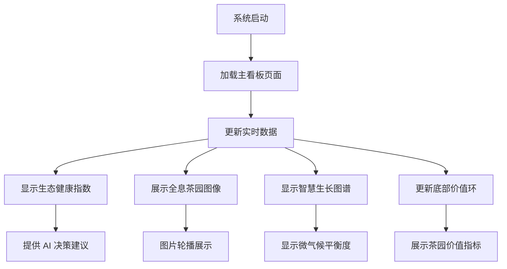

## 1. Product Overview
时茗园 - 智慧茶园可视化看板，一个集成生态数据监测和 AI 决策支持的智能农业管理系统。
- 主要用于实时监测茶园生态健康状况，提供数据可视化和 AI 决策建议，帮助茶园管理者优化生产。
- 目标用户为茶园管理者、农业技术人员和生态监测专家，市场价值在于提升茶园管理效率和生态可持续性。

## 2. Core Features

### 2.1 User Roles
| Role | Registration Method | Core Permissions |
|------|---------------------|------------------|
| 茶园管理者 | 系统登录 | 查看所有数据和决策建议，管理茶园参数 |
| 技术人员 | 系统登录 | 查看数据和分析报告，提供技术支持 |
| 生态专家 | 系统登录 | 分析生态数据，提供生态优化建议 |

### 2.2 Feature Module
1. **主看板页面**：顶部状态栏、生态健康指数面板、全息茶园展示、智慧生长图谱面板、底部价值环

### 2.3 Page Details
| Page Name | Module Name | Feature description |
|-----------|-------------|---------------------|
| 主看板页面 | 顶部状态栏 | 显示系统标题、实时温度、湿度、天气信息和当前时间 |
| 主看板页面 | 生态健康指数面板 | 显示生态健康评分、雷达图分析、生物多样性丰度数据和柱状图 |
| 主看板页面 | 全息茶园展示 | 显示茶园 3D 全息图像，支持图片轮播，展示茶园实时状态 |
| 主看板页面 | 智慧生长图谱面板 | 显示生长曲线、微气候平衡度仪表图、AI 预警信息 |
| 主看板页面 | 底部价值环 | 以透明气泡形式显示年固碳量、水资源循环率、零碳足迹进度和社区共生价值 |

## 3. Core Process
用户打开系统后，主看板页面自动加载所有数据，实时更新各项指标。用户可以查看生态健康指数、全息茶园展示、智慧生长图谱和底部价值环等模块，获取茶园的全面状况。系统会根据实时数据提供 AI 决策建议和预警信息。

## 4. User Interface Design
### 4.1 Design Style
- 主色调：生态绿 (#00ff88)、科技蓝 (#00d4ff)、大地金 (#ffcc33)
- 背景色：深黑色 (#0a1118)
- 玻璃态效果：半透明背景 (rgba(255, 255, 255, 0.05)) 和边框 (rgba(255, 255, 255, 0.1))
- 按钮风格：圆角设计，带有发光效果
- 字体：Orbitron (标题)、Noto Sans SC (正文)
- 布局风格：卡片式布局，带有玻璃态效果和动画
- 图标风格：简约现代，带有科技感

### 4.2 Page Design Overview
| Page Name | Module Name | UI Elements |
|-----------|-------------|-------------|
| 主看板页面 | 顶部状态栏 | 渐变标题文字，实时数据显示，右侧时间更新 |
| 主看板页面 | 生态健康指数面板 | 玻璃态卡片，雷达图，生物多样性标签，柱状图 |
| 主看板页面 | 全息茶园展示 | 3D 全息图像，发光效果，图片轮播，全息底座 |
| 主看板页面 | 智慧生长图谱面板 | 玻璃态卡片，生长曲线图，微气候仪表图，AI 预警信息 |
| 主看板页面 | 底部价值环 | 透明气泡卡片，流动动画效果，悬停交互，图标显示 |

### 4.3 Responsiveness
- 设计采用桌面优先原则，适配 1920x1080 及以上分辨率
- 支持响应式布局，在不同屏幕尺寸下自动调整组件大小和位置
- 触摸优化：支持触摸设备的交互操作

### 4.4 3D Scene Guidance
- 全息茶园展示采用 3D 效果，带有发光边缘和悬浮动画
- 环境氛围：科技感十足，带有蓝色和绿色的光晕效果
- 相机设置：固定视角，轻微旋转效果
- 交互：支持图片轮播，自动切换展示不同角度的茶园景象