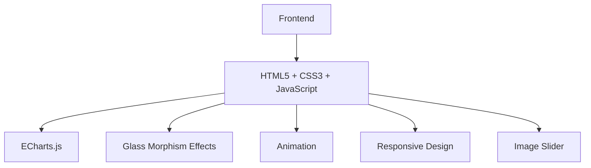

## 1. Architecture Design

## 2. Technology Description
- Frontend: HTML5 + CSS3 + JavaScript
- Data Visualization: ECharts.js@5.4.3
- Fonts: Google Fonts (Orbitron, Noto Sans SC)
- Image Generation: Trae API Text-to-Image
- Animation: CSS Animations + JavaScript
- Responsive Design: CSS Grid + Flexbox

## 3. Route Definitions
| Route | Purpose |
|-------|---------|
| / | 主看板页面，显示所有数据和可视化内容 |

## 4. API Definitions
无后端 API，所有数据为前端模拟数据。

## 5. Server Architecture Diagram
无后端服务器架构。

## 6. Data Model
### 6.1 Data Model Definition
无数据库，所有数据为前端模拟数据。

### 6.2 Data Definition Language
无数据库表定义。

## 7. Implementation Details
### 7.1 Frontend Structure
- `demo_v1.html`: 主页面文件，包含所有 HTML 结构
- 内联 CSS: 包含所有样式定义
- 内联 JavaScript: 包含所有交互逻辑和数据可视化

### 7.2 Key Components
1. **顶部状态栏**: 显示系统标题、实时环境数据和时间
2. **生态健康指数面板**: 包含雷达图和生物多样性数据
3. **全息茶园展示**: 包含 3D 全息图像和轮播功能
4. **智慧生长图谱面板**: 包含生长曲线、微气候仪表图和 AI 预警
5. **底部价值环**: 包含透明气泡形式的价值指标

### 7.3 Data Visualization
- 使用 ECharts.js 实现雷达图、柱状图、折线图和仪表图
- 实时数据更新和动画效果

### 7.4 Animation Effects
- 悬浮动画：全息图像和价值卡片的悬浮效果
- 流动动画：价值卡片的背景流动效果
- 淡入动画：面板的淡入效果
- 轮播动画：全息图像的轮播切换效果

### 7.5 Responsive Design
- 使用 CSS Grid 和 Flexbox 实现响应式布局
- 适配不同屏幕尺寸
- 触摸设备优化