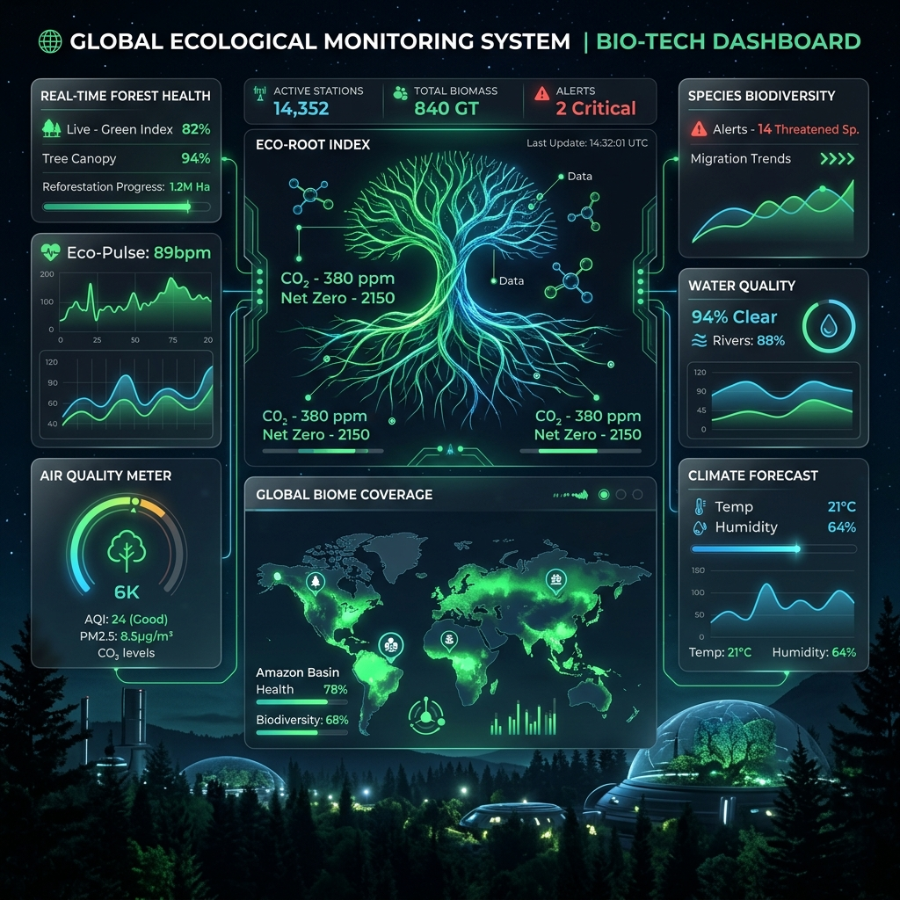

# 🍃 时茗园 (Time Tea Garden) - 生态守护全景大屏



> **让数据扎根自然，用智能感知生态。**

**时茗园** 是一款面向未来的智慧茶园可视化决策中枢。通过前沿的视觉引擎与实时数据处理技术，系统深度解析微气候平衡、生物多样性、碳循环及社会生态价值，为现代生态茶园管理提供数字孪生级别的可视化支持。

## ✨ 核心特性

- **🌳 中央全息沙盘**: 以抽象图腾和空间感展示茶园立体碳汇、地下根系健康，以及能量循环体系。
- **🦉 生态星河监控**: 融合声纹与影像识别数据的生物多样性图谱，动态展示物种丰度。
- **📈 智慧生长图谱**: 基于 AI 决策的生长曲线、节气（谷雨、立夏、小满、芒种）时空穿梭交互模拟。
- **💎 可持续价值环**: 环境 (EE)、社会 (SE) 等维度的可持续指数实时反馈。
- **🚀 创新视觉引擎**: 
    - **RootNetwork**: 模拟生态根系脉动与水资源循环。
    - **EcoGalaxy**: 生物多样性的粒子星河态可视化。
    - **LightFlow**: 数据流动与预警指令的视觉仿真。
    - **EcoScanner**: 生态探测与气候健康维度的雷达扫描动效。

## 🛠 技术栈

| 维度 | 技术选型 |
| :--- | :--- |
| **框架** | [Vue 3](https://vuejs.org/) (Composition API) |
| **构建** | [Vite 5](https://vitejs.dev/) |
| **语言** | [TypeScript](https://www.typescriptlang.org/) |
| **样式** | [Tailwind CSS](https://tailwindcss.com/) |
| **可视化** | [Apache ECharts](https://echarts.apache.org/) |
| **图标** | [Lucide Vue Next](https://lucide.dev/) |

## 🚀 快速入门

### 环境准备
- Node.js 18.x 或更高版本
- npm / pnpm / yarn

### 安装与运行
```bash
# 1. 安装项目依赖
npm install

# 2. 启动开发服务器
npm run dev
```

### 项目构建
```bash
# 构建高保真生产版本
npm run build

# 本地预览构建产物
npm run preview
```

## 📂 核心目录结构

```text
src/
├── components/
│   ├── visuals/               # 全息组件群 (RootNetwork, LightFlow, EcoGalaxy, TimelineSlider等)
│   ├── PretextBIDashboard.vue # 时茗园·生态守护全景主看板
│   └── PretextRenderer.vue    # 文本与高发光特效渲染器
├── index.css                  # 全局主题配置与Tailwind入口
├── App.vue                    # 入口挂载组件
└── main.ts                    # 启动逻辑
```

---
*Developed as part of the ZYZT Smart Ecological Project Initiatives.*
