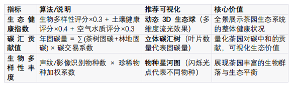
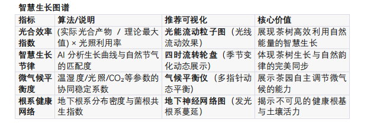
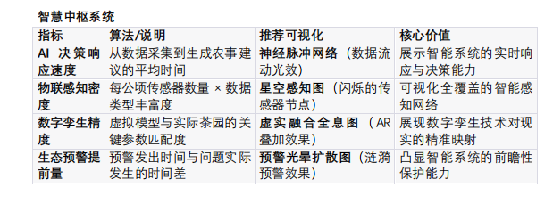
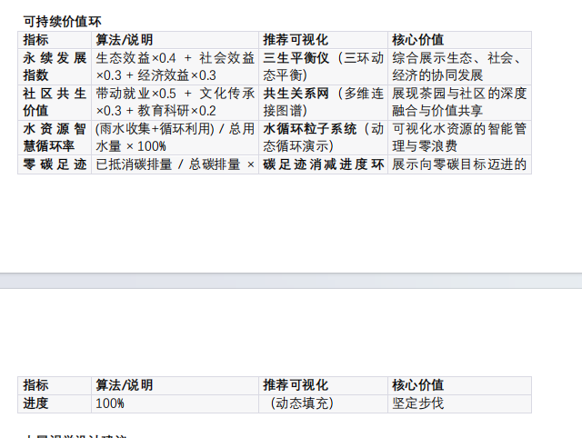

# 没实现的

## 生态守护全景

## 智慧生长图谱

## 智慧中枢系统

## 可持续价值环

大屏视觉设计建议
整体风格
• 主色调：生态绿+智慧蓝+大地金
• 动态效果：粒子流动、光线追踪、渐变流光
• 交互方式：手势控制、语音交互、多屏联动
核心视觉焦点
1. 中央全息沙盘：3D 茶园模型，实时数据流动
2. 左侧生态星河：生物多样性动态展示
3. 右侧智慧光流：数据流与决策路径可视化
4. 底部价值环：可持续发展指标动态环
   交互亮点
   • 手势缩放：从宏观生态到单片茶叶的逐级下钻
   • 时空穿梭：滑动时间轴查看不同季节/年份变化
   • 角色切换：投资者/消费者/研究者不同视角
   • AR 增强：手机扫描可查看茶叶详细溯源信息
   地址：无锡市时茗园
